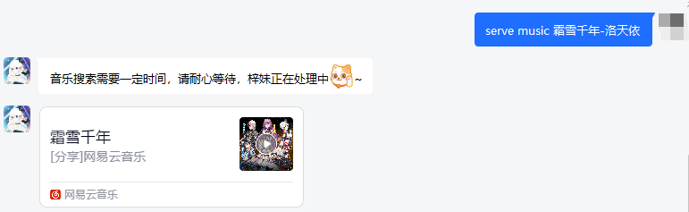

## 一 智梓QQ机器人
### 1.1 简介

智梓QQ机器人是一款功能性的机器人，包含有群管理功能和私人消息功能，其中群管理功能较为完善。

主要用于群管理，减少管理员和群主对群的管理成本。

其中资源数据全部来源于网络，机器人自身不存储任何除本身配置文件的资源信息。

## 二 智梓功能
### 2.1 私人信息功能

1. serve weather 地区：查询当前地区的天气情况
   
2. serve music 音乐名：获取当前音乐的分享
   
3. serve sing：智梓唱歌（由于框架原因暂不支持私聊唱歌）
4. 支持自定义好友验证结果

### 2.2 群管理功能

在智梓注册群中并且开机后可使用命令

1. @智梓 group info 查看群信息
   
2. @智梓 group status 查看梓妹状态
   
3. @智梓 music 音乐名称
   
4. @智梓 weather 地区
   
5. @智梓 sing
   
6. @智梓 news
   
7. @智梓 lsjt
   
8. @智梓 joke
   
9. **监听敏感关键词,如果拥有权限则撤回此条消息**
10. **定时任务 news新闻 , joke笑话 , 随机音乐分享**

### 2.3 应用管理功能

1. app 应用信息
   
2. jvm 虚拟机信息
   
3. sophon 梓妹信息
   
4. system 系统信息
   
   
## 三 使用
通过github导入项目,完成依赖导入后,在simbot.yml中添加账号密码即可使用;

启动：pvt.example.sophon.SophonRobotApplication启动类

## 感谢
智梓QQ机器人项目基于[ForteScarlet](https://github.com/ForteScarlet/) 的 [Simpler-Robot](https://github.com/ForteScarlet/simpler-robot) 框架开发

PS：Simbot框架是基于Mirai机器人框架;

## 后记
智梓机器人0.0.1暂时开发完成,代码开源,会对后续功能进行完善和增加

PS: 后续可能会堆机器人进行层级重新划分
 